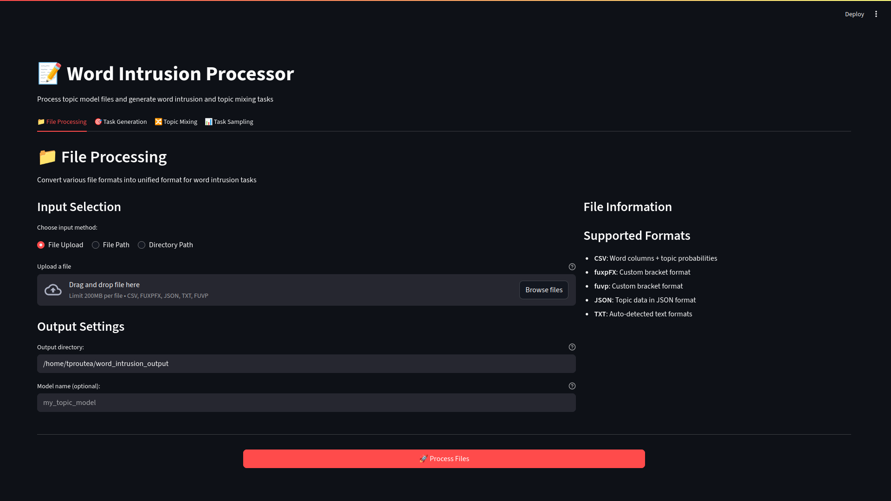
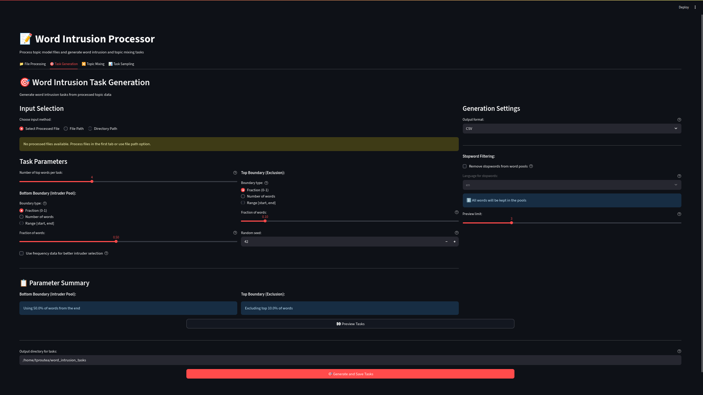
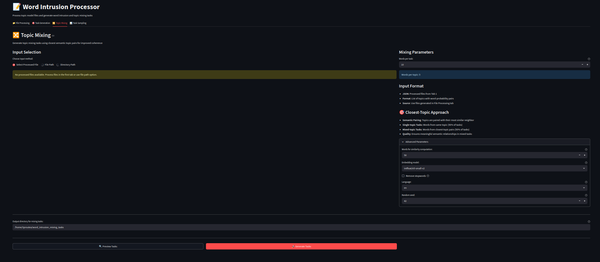
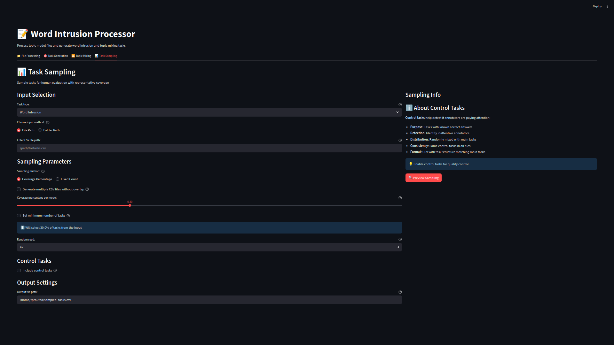

# Word Intrusion and Topic Mixing - Task Generation Interface

This directory contains the Streamlit application and core modules for generating and managing human evaluation tasks for topic models, including both traditional word intrusion and the novel Topic Word Mixing (TWM) tasks.

## Directory Structure

```
word_intrusion_and_mixing/
├── streamlit_app.py              # Main Streamlit application
├── requirements.txt              # Python dependencies
├── run_app.sh                    # Script to run the application
├── sample_topics.json            # Sample data for testing
├── .gitignore                    # Git ignore file
│
├── Documentation files:
│   ├── README.md                 # This file
│   ├── MANIFEST.md               # Detailed file manifest
│   ├── PACKAGE_README.md         # Package documentation
│   ├── STOPWORD_ANALYSIS_README.md   # Stopword functionality documentation
│   └── STOPWORD_TOOLS_GUIDE.md   # Stopword tools guide
│
└── word_intrusion/               # Main package directory
    ├── __init__.py               # Package initialization
    │
    ├── word_intrusion/           # Word intrusion module
    │   ├── __init__.py
    │   ├── core.py               # Core word intrusion logic
    │   ├── processors.py         # WordIntrusionProcessor class
    │   ├── file_processor.py     # FileProcessor class
    │   ├── word_check.py         # Word checking functionality
    │   └── cli.py                # Command-line interface
    │setup
    ├── topic_mixing/             # Topic mixing module
    │   ├── __init__.py
    │   ├── core.py               # Core topic mixing logic
    │   └── processors.py         # TopicMixingProcessor class
    │
    ├── task_selector/            # Task selection/sampling module
    │   ├── __init__.py
    │   └── selector.py           # TaskSelector and folder processing
    │
    ├── baml_client/              # BAML client for LLM integration
    │   ├── __init__.py
    │   ├── async_client.py
    │   ├── sync_client.py
    │   ├── types.py
    │   └── [other client files]
    │
    └── baml_src/                 # BAML configuration
        ├── clients.baml          # Client configuration
        ├── generators.baml       # Generator configuration
        └── word_checker.baml     # Word checking logic
```

## Installation

1. Install dependencies:
```bash
pip install -r requirements.txt
```

2. Run the application:
```bash
bash run_app.sh
```

Or directly:
```bash
streamlit run streamlit_app.py
```

## Features

The Streamlit app provides four main tabs:

1. **File Processing**: Convert various topic model formats to unified JSON format
2. **Task Generation**: Generate word intrusion tasks from processed data
3. **Topic Mixing**: Create topic mixing tasks using semantic similarity
4. **Task Sampling**: Sample tasks for human evaluation with coverage control

## Key Components

- **FileProcessor**: Handles multiple input formats (CSV, JSON, fuxpFX, fuvp, TXT)
- **WordIntrusionProcessor**: Generates word intrusion tasks with configurable parameters
- **TopicMixingProcessor**: Creates mixing tasks based on topic similarity
- **TaskSelector**: Samples tasks for evaluation with various strategies

## Dependencies

Main dependencies include:
- streamlit
- pandas
- sentence-transformers (for topic mixing)
- spacy (for stopword filtering)
- scikit-learn
- torch/transformers (for embedding models)

See `requirements.txt` for complete list.

## Tab Parameters Documentation

### Tab 1: File Processing

Converts various topic model formats into unified JSON format for task generation.


*Tab 1: File Processing interface for converting various topic model formats*

#### Input Parameters
- **Input Method**: Choose how to provide input
  - `File Upload`: Upload a file directly through the browser
  - `File Path`: Enter absolute path to a single file
  - `Directory Path`: Enter absolute path to a directory
- **Recursive Processing** (Directory only): Include files in subdirectories (default: `True`)

#### Output Parameters
- **Output Directory**: Directory where processed files will be saved
- **Model Name** (Optional): Name to include in output filenames for identification

#### Supported Input Formats
- **CSV**: Word columns with topic probabilities
- **fuxpFX**: Custom bracket format
- **fuvp**: Custom bracket format  
- **JSON**: Topic data in JSON format
- **TXT**: Auto-detected text formats

---

### Tab 2: Task Generation (Word Intrusion)

Generates word intrusion tasks from processed topic data.


*Tab 2: Word Intrusion task generation with configurable parameters*

#### Input Parameters
- **Input Method**: Source of processed topic data
  - `Select Processed File`: Choose from files processed in Tab 1
  - `File Path`: Enter path to a processed JSON file
  - `Directory Path`: Enter path to directory with processed files
- **Recursive Processing** (Directory only): Include subdirectories (default: `True`)

#### Task Parameters
- **Number of Top Words per Task**: Number of coherent words in each task
  - Range: 3-6 words (default: `4`)
  - These are the "good" words from the same topic

- **Bottom Boundary (Intruder Pool)**: Defines where to select intruder words from
  - **Fraction (0-1)**: Fraction of topic's word list (e.g., `0.5` = bottom 50%)
  - **Number of Words**: Fixed number of bottom words (e.g., `[100]` = bottom 100 words)
  - **Range [start, end]**: Specific range (e.g., `[50, 150]` = words ranked 50-150)
  - Purpose: Lower-ranked words are less related to the topic, making good intruders

- **Top Boundary (Exclusion)**: Defines which words to exclude from being intruders
  - **Fraction (0-1)**: Fraction of topic's word list to exclude (e.g., `0.2` = top 20%)
  - **Number of Words**: Fixed number of top words to exclude (e.g., `[20]` = top 20 words)
  - **Range [start, end]**: Specific range to exclude (e.g., `[0, 30]` = words ranked 0-30)
  - Purpose: Prevents highly-related words from being selected as intruders

- **Random Seed**: Seed for reproducible task generation
  - Range: 1-9999 (default: `42`)

#### Frequency Data (Optional)
- **Use Frequency Data**: Improve intruder selection using word frequencies
- **Frequency Data File Path**: Path to pickle file containing word frequencies
  - Helps select intruders that are corpus-appropriate

#### Stopword Filtering
- **Remove Stopwords**: Filter common stopwords from word pools (default: `False`)
- **Language**: Language for stopword filtering
  - Options: `en` (English), `fr` (French)
  - Uses spaCy for stopword detection

#### Output Settings
- **Output Directory**: Directory for saving generated tasks (default: `/home/tproutea/word_intrusion_tasks`)
- **Output Format**: File format for tasks
  - Options: `CSV`, `JSON`
- **Preview Limit**: Number of tasks to show in preview (range: 1-10, default: `3`)

---

### Tab 3: Topic Mixing

Generates topic mixing tasks using semantic similarity between topics.


*Tab 3: Topic Mixing task generation using semantic similarity*

#### Input Parameters
- **Input Method**: Source of processed topic data
  - `Select Processed File`: Choose from files processed in Tab 1
  - `File Path`: Enter path to a processed JSON file
  - `Directory Path`: Enter path to directory with processed files
- **Recursive Processing** (Directory only): Include subdirectories (default: `True`)

#### Mixing Parameters
- **Words per Task**: Total number of words in each mixing task
  - Range: 4-20 words, must be even (default: `10`)
  - Automatically splits equally between topics (e.g., 10 words = 5 per topic)

#### Task Generation Strategy
- **50% Single-topic Tasks**: Words all from the same coherent topic (quartile = -1)
- **50% Mixed-topic Tasks**: Words from closest semantic topic pairs (quartile = 0)
- Tasks use semantic pairing to ensure meaningful relationships

#### Advanced Parameters
- **Words for Similarity Computation**: Number of top words used to compute topic similarities
  - Range: 10-200 (default: `50`)
  - More words = more comprehensive similarity calculation

- **Embedding Model**: Sentence transformer model for computing topic similarities
  - Options:
    - `intfloat/e5-small-v2` (default)
    - `BAAI/bge-small-en-v1.5`
    - `thenlper/gte-small`
    - `sentence-transformers/all-MiniLM-L6-v2`
    - `sentence-transformers/all-mpnet-base-v2`
    - `sentence-transformers/paraphrase-multilingual-MiniLM-L12-v2`
    - `NovaSearch/stella_en_1.5B_v5`

- **Remove Stopwords**: Filter common stopwords (default: `False`)
- **Language**: Language for stopword filtering (`en` or `fr`)
- **Random Seed**: Seed for reproducible results (default: `42`)

#### Output Settings (Single File/Directory)
- **Output Directory**: Directory for saving mixing tasks (default: `/home/tproutea/word_intrusion_mixing_tasks`)
- **Output Format** (Batch only): File format for tasks (`CSV` or `JSON`)

---

### Tab 4: Task Sampling

Samples tasks for human evaluation with representative coverage across models and topics.


*Tab 4: Task Sampling for creating evaluation sets with coverage control*

#### Input Parameters
- **Task Type**: Type of tasks to sample
  - Options: `Word Intrusion`, `Topic Mixing`
- **Input Method**: Source of task files
  - `File Path`: Single CSV file
  - `Folder Path`: Directory containing multiple CSV files

#### Sampling Parameters
- **Sampling Method**: How to select tasks
  - **Coverage Percentage**: Sample a percentage from each model
  - **Fixed Count**: Sample a fixed number of tasks

##### Coverage Percentage Mode
- **Coverage Percentage per Model**: Percentage of tasks to sample from each model
  - Range: 0.01-1.0 (1%-100%, default: `0.3` = 30%)
  - Applied independently to each model for balanced representation

- **Set Minimum Number of Tasks**: Ensure minimum tasks even if percentage yields fewer
  - **Minimum Tasks**: Minimum number of tasks to select (when enabled)
  - Useful for models with few tasks

##### Fixed Count Mode
- **Word Intrusion**:
  - **Topics per Model**: Number of topics to sample per model (default: `2`)
  - **Tasks per Topic**: Number of tasks per selected topic (default: `1`)
  - Total tasks = models × topics_per_model × tasks_per_topic

- **Topic Mixing**:
  - **Single-topic Tasks (Q=-1)**: Number of single-topic tasks per model (default: `25`)
  - **Closest-topic Mixed Tasks (Q=0)**: Number of mixed-topic tasks per model (default: `25`)
  - Ensures balanced evaluation of coherence vs. distinctness

#### Multiple Files Option
- **Generate Multiple CSV Files**: Create multiple sampling files without task overlap
- **Number of Files**: Number of separate CSV files to create (range: 2-10, default: `3`)
- Each file maintains same sampling parameters but uses different random seeds
- Useful for creating separate evaluation sets for different annotators

#### Control Tasks
- **Include Control Tasks**: Add control tasks for quality assurance (default: `False`)
- **Control Tasks File**: Path to CSV file containing control tasks

##### Word Intrusion Control Tasks
- **Control Tasks per File**: Number of control tasks to add per output file
- Purpose: Detect inattentive annotators with known correct answers
- Format: Same structure as main tasks

##### Topic Mixing Control Tasks
- **Single-topic Control Tasks (Q=-10)**: Tasks with words from same coherent topic
- **Two-topic Control Tasks (Q=-20)**: Tasks with words from clearly different topics
- Purpose: Validate annotator ability to distinguish topic coherence
- Distribution: Equal representation of both control types

#### General Parameters
- **Random Seed**: Seed for reproducible sampling (default: `42`)

#### Output Settings
- **Single File Mode**:
  - **Output File Path**: Path where sampled tasks will be saved (default: `/home/tproutea/sampled_tasks.csv`)

- **Multiple Files Mode**:
  - **Output Directory**: Directory where multiple CSV files will be saved (default: `/home/tproutea/sampled_tasks_batch/`)
  - **File Prefix**: Prefix for generated files (default: `sampled_tasks`)
    - Generated files: `{prefix}_1.csv`, `{prefix}_2.csv`, etc.

---

## Usage Notes

- The app supports both single file and batch directory processing
- Stopword filtering is available for both word intrusion and topic mixing
- Control tasks can be added for quality assurance in sampling
- Multiple sampling files can be generated without overlap
- Preview functionality available for all task generation tabs before committing to full generation

## Package Structure

This deployment maintains the package structure from the main repository:
- `word_intrusion/word_intrusion/`: Traditional word intrusion tasks
- `word_intrusion/topic_mixing/`: Topic mixing functionality
- `word_intrusion/task_selector/`: Task sampling and selection
- `word_intrusion/baml_client/`: BAML integration for word checking
